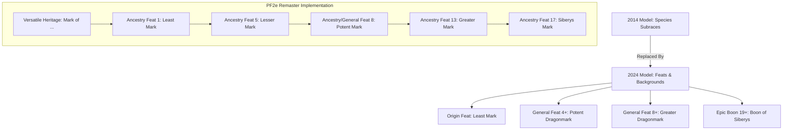
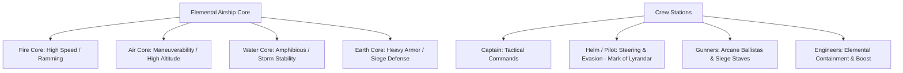

# Updates to PF2e Conversion for 2024 Eberron Content

**Document Version:** 1.1.0  
**Target Systems:** Pathfinder 2e Remaster (Foundry VTT PF2e System 8.5.1+ / Foundry v14+)  
**Analyzed Sources:**
- [*Eberron: Forge of the Artificer* (2024 / 5.5e)](https://www.dndbeyond.com/marketplace/sourcebooks/eberron-forge-of-the-artificer) (Foundry Gaming LLC)
- [*Exploring Eberron (2024 / 5.5e Update)*](https://www.dndbeyond.com/marketplace/sourcebooks/exploring-eberron) (Keith Baker, D&D Beyond / DMs Guild)
- [*Frontiers of Eberron: Quickstone (2024 / 5.5e)*](https://www.dndbeyond.com/marketplace/sourcebooks/frontiers-of-eberron-quickstone) (Keith Baker, D&D Beyond / DMs Guild)
- [*Chronicles of Eberron*](https://www.dndbeyond.com/marketplace/sourcebooks/chronicles-of-eberron) (Keith Baker, D&D Beyond / DMs Guild)

---

## Executive Summary & Design Architecture

The 2024 D&D 5.5e releases and official Eberron expansions (*Forge of the Artificer*, *Exploring Eberron 5.5e*, and *Frontiers of Eberron: Quickstone*) modernize the setting's mechanics.

To ensure our Pathfinder 2e conversion is seamless, robust, and intuitive, the implementation sequence follows the fundamental **PF2e Character Creation Architecture ("ABC")**:
1. **Ancestries, Heritages & Ancestry Feats** (including the 2024 Dragonmark transition to Versatile Heritages)
2. **Backgrounds & Origin Options** (14 House Heir backgrounds and Frontier backgrounds)
3. **Religions, Deities & Divine Domains** (establishing pantheons, fonts, and domains before classes)
4. **Classes, Subclasses & Archetypes** (Inventors/Artificers, Wandslingers, and new martial/caster archetypes)
5. **Spells, Focus Spells & Magic Items** (Focus spells, symbionts, Dhakaani relics, and dragonmark items)
6. **Vehicles & Subsystems** (Elemental Airships as PF2e vehicles, native Downtime for enclaves, and Noir Investigation)

This dependency hierarchy ensures that when building a class or archetype, its prerequisite deities, ancestries, backgrounds, and domain spells are already registered in the system.

---

## 1. Ancestries, Heritages & Lineage Feats

### 1.1 Core Ancestry Modernizations (2024 Remaster Alignment)

The 2024 revisions streamline species abilities, resolving ambiguities in action economy and size mechanics:

- **Changeling (`eberron-ancestries/`):**
  - *Change Shape:* Explicitly adapts cosmetic clothing and gear coloration (purely aesthetic) without requiring tailoring.
  - *Changeling Instincts (Feat 1):* Trained in Deception and Perception; +1 circumstance bonus to Lie and Sense Motive.
- **Kalashtar (`eberron-ancestries/`):**
  - *Dual Mind:* Harmonize with PF2e Remaster Will defense: +2 circumstance bonus to Will saves against mental and emotion effects.
  - *Severed from Dreams:* Permanent immunity to the *Sleep* spell and magical effects with the *Dream* trait.
- **Shifter (`eberron-heritages/`):**
  - *Shift (1 Action):* Standardize across all heritages: grants temporary HP equal to character level + Constitution modifier for 1 minute in addition to the heritage feature (*Beasthide*, *Longstride*, *Swiftstride*, *Wildhunt*).
  - *Reactive Shift (Feat 4, Reaction):* Trigger: An enemy enters reach; Step 10 feet away.
- **Warforged (`eberron-ancestries/`):**
  - *Constructed Resilience:* Retains the *Construct* trait and immunity to disease, sleep, and paralyzed conditions; clarify compatibility with the PF2e Remaster *Void/Vitality* healing rules.

---

### 1.2 Dragonmarks: The 2024 Shift to Versatile Heritages

#### The 2024 Paradigm Shift
In 2014 D&D (*Rising from the Last War*), dragonmarks were modeled as **variant species/subraces** (e.g. *Mark of Making Human*, *Mark of Storm Half-Elf*). In 2024 D&D (*Forge of the Artificer*, Chapter 2), dragonmarks undergo a fundamental architectural shift:
- **Dragonmarks are Feats, Not Species:** Characters of **any species** can manifest a dragonmark.
- **Four-Tiered Feat Hierarchy:** Least Mark (Level 1), Potent Dragonmark (General Feat 4+), Greater Dragonmark (General Feats 8+), and Boon of Siberys (Epic Boon 19+).

#### PF2e Modernization Path
Currently, [`Subsections/dragonmarks.txt`](file:///Users/jschoudt/git/github.com/jschoudt/Pathfinder2eConversion/Subsections/dragonmarks.txt#L22-L93) and `src/packs/eberron-heritages/` lock marks to specific ancestries (except for [`Aberrant Mark`](file:///Users/jschoudt/git/github.com/jschoudt/Pathfinder2eConversion/src/packs/eberron-heritages/Aberrant_Mark__Versatile__Dragonmarked_Ancestries__Heritage__3nDfWHKlc2YXHcDs.json), which is already a Versatile Heritage).

1. **Convert All 12 True Dragonmarks to Versatile Heritages:**
   - E.g., `Mark of Sentinel Versatile Heritage`, `Mark of Storm Versatile Heritage`.
   - *Why:* Aligns with 2024's "any species can manifest a mark," fixes legacy Half-Elf (Khoravar) heritage clunkiness, and accommodates House-adopted lineages.
2. **Harmonize Focus Pools with PF2e Remaster:**
   - In Remaster rules, characters Refocus to restore **all** spent Focus Points (10 minutes per point).
   - Update `Least Mark (Feat 1)`, `Lesser Dragonmarked Evolution (Feat 9)`, and `Siberys Mark (Feat 17)` to align with Remaster Focus Pool standards (max pool 3).
3. **Intuition Die Translation:**
   - 2024 adds a `1d4` Intuition Die to two skills per mark.
   - *PF2e Translation:* Grant a permanent **+1 circumstance bonus** to checks with those two skills, plus a 1-action fortune activity: **Mark's Intuition** (Frequency: once per hour; roll twice and take the higher result).
4. **Distinct Greater Dragonmark Feats:**
   - Add individual Level 13 `Greater Mark` feats for each house (e.g., *Greater Mark of Storm*, *Greater Mark of Making*) granting innate rank 7-8 spells (*Control Weather*, *Fabricate*, *Teleport*).

---

## 2. Backgrounds & Origin Options

In 2024 D&D, backgrounds define origin feats and attribute increases. In PF2e, Backgrounds provide two attribute boosts, trained skill proficiencies, lore, and a skill feat.

### 2.1 The 14 Dragonmarked House Heir Backgrounds
Add 14 House Heir Backgrounds to `src/packs/eberron-backgrounds/`:
- **House Cannith Heir:** Boosts: Intelligence, Free. Trained in Crafting and *House Cannith Lore*. Skill Feat: *Crafter's Appraisal*. Grants access to Mark of Making feats.
- **House Deneith Heir:** Boosts: Strength or Charisma, Free. Trained in Athletics and *House Deneith Lore*. Skill Feat: *Combat Climber*. Grants access to Mark of Sentinel feats.
- **House Medani Inquisitive Heir:** Boosts: Intelligence or Wisdom, Free. Trained in Perception/Investigation and *House Medani Lore*. Skill Feat: *That's Odd* or *Notice Signs*. Grants access to Mark of Detection feats.
- **House Sivis Scribe Heir:** Boosts: Intelligence or Charisma, Free. Trained in Society and *House Sivis Lore*. Skill Feat: *Multilingual*. Grants access to Mark of Scribing feats.
- **Aberrant Heir:** Boosts: Constitution, Free. Trained in Intimidation and *Underworld Lore*. Skill Feat: *Intimidating Glare*. Grants access to Aberrant Mark feats.

### 2.2 Frontier & Droaam Backgrounds (*Quickstone*)
- **Dragonshard Prospector:** Boosts: Wisdom or Constitution, Free. Trained in Survival and *Dragonshard Lore*. Skill Feat: *Terrain Stalker*.
- **Wandslinger Veteran:** Boosts: Dexterity or Charisma, Free. Trained in Acrobatics and *Warfare Lore*. Skill Feat: *Quick Draw* (or *Wand Draw*).
- **Frontier Marshal:** Boosts: Wisdom or Strength, Free. Trained in Survival and *Legal Lore*. Skill Feat: *Experienced Tracker*.
- **Droaam Emissary:** Boosts: Charisma or Intelligence, Free. Trained in Diplomacy and *Droaam Lore*. Skill Feat: *Hobnobber*.

---

## 3. Religions, Deities & Divine Domains

Before implementing Divine and Primal classes, their patron deities, edicts, anathemas, and divine domains must be established:

### 3.1 New & Expanded Domains
- **Commerce Domain (Kol Korran & House Kundarak):**
  - *Initial Focus Spell (1st Rank):* **Divine Coin Toss** (1 Action). Gamble fortune: roll 1d4 on an ally's d20 check; on 1, +1 status bonus; on 4, +3 status bonus.
  - *Advanced Focus Spell (4th Rank):* **Contractual Recoil** (Reaction). When an enemy violates an agreement, attacks a protected ward, or reneges on a surrender, deals 1d6 force damage per spell rank.
- **Mind Domain (Path of Light, Reidran Faiths):**
  - *Initial Focus Spell:* **Mental Shielding** (Reaction). +2 status bonus against mental effects; reflects psychic feedback.
  - *Advanced Focus Spell:* **Thought Projection** (2 Actions). Transmit telepathic commands and reveal enemy intent (+1 to AC against target).

### 3.2 Frontier & Droaam Syncretisms (*Quickstone*)
- **The Dark Six (Frontier Cults):** The Shadow (arcane corruption), The Fury (passion and wild revenge), The Mockery (cunning warfare in Droaam).
- **Medusa / Stone Sovereign Faith:** Earth veneration, petrification as eternal preservation, architectural sculpting.

---

## 4. Classes, Subclasses & Archetypes

### 4.1 Artificer & Inventor Innovations (*Forge of the Artificer* & *EE 5.5e*)

- **Leyline Cartographer (Brand New Subclass -> Inventor / Witch / Investigator Archetype):**
  - *Cartographer's Craft:* Trained in Surveying Lore; ignore non-magical difficult terrain.
  - *Survey the Ley Lines (1 Action):* Grant allies within 30 ft a +10 ft status bonus to speed for 1 round.
  - *Waypoint Anchor (Focus Spell):* Place a teleportation tether beacon that allies can warp to.
  - *Leyline Shifting (Feat 8):* Reconfigure terrain in a 20-ft burst.
- **Dreadnaught Armorer Model (New 2024 Heavy Armor Model):**
  - *Dreadnaught Juggernaut Suit (Modification):* Heavy armor with Bulwark; +1 circumstance to Shove/Trip.
  - *Force Demolisher Strike (Feat 4):* 1d10 Bludgeoning + 1d6 Force; ignores half object Hardness.
  - *Giant Stature Overcharge (Feat 12, Unstable):* Grow to Large/Huge, +10 ft reach, +2 status bonus to melee damage.
- **Forge Adept (*Exploring Eberron 5.5e*):**
  - *Ghaal'shaarat Bond:* Weapon automatically scales fundamental runes; gains *Resonant* trait.
  - *Runes of War (Focus Spell):* Imbue weapon with elemental or vitality/void damage.
- **Maverick (*Exploring Eberron 5.5e*):**
  - *Cross-Tradition Spell Hacking:* Prepare 1 spell per rank from Divine, Occult, or Primal lists into Arcane slots.

### 4.2 Wandslinger & Western Frontier Archetypes (*Quickstone*)

- **College of Wands (Bard) & Way of the Wandslinger Expansion:**
  - Expand [`Way_of_the_Wandslinger`](file:///Users/jschoudt/git/github.com/jschoudt/Pathfinder2eConversion/src/packs/eberron-classes/Way_of_the_Wandslinger_PMZjc5rLWtWV9vEW.json) with *Wand Dueling*, *Quick-Draw Wand*, and *Deflective Cantrip* reactions.
- **Path of the Demonshard (Barbarian):**
  - *Khyber Demonshard Instinct:* Rage adds Void/Fire damage, grants physical resistance against non-byeshk weapons, and causes frightened aura.
- **Bloodhound (Ranger):**
  - *Bloodhound Hunter's Edge:* Relentless pursuit, scent imprecise sense 30 ft, bonus against disguises.
- **Nemesis Sorcery:**
  - *Nemesis Bloodline (Occult):* Retributive curses and focus spells that punish attackers.
- **Stone Sovereign (Witch / Patron):**
  - *Stone Sovereign Patron:* Earth kineticist crossover, petrification gaze, and calcified armor.

### 4.3 Dhakaani & Forged Traditions (*Exploring Eberron 5.5e*)

- **College of the Dirge Singer (Bard):**
  - *Song of the Iron Will (Composition Cantrip):* +1 status bonus to Will saves against fear and +1 to Athletics.
  - *Dirge of the Victorious Blade (Focus Spell):* On ally critical hit, deals sonic/mental damage in 10-ft burst.
- **Circle of the Forged (Druid):**
  - *Construct Wild Shape:* Retains Construct trait, Integrated Plating (+1 AC), resistance to precision and bleed.
- **Warrior of the Living Weapon (Monk):**
  - *Tendril Whip Stance (Feat 1):* Unarmed attacks gain 10-ft reach, Finesse, Trip.
  - *Carapace Stance (Feat 4):* 1d8 Bludgeoning with Parry; +1 circumstance to AC and physical resistance.

---

## 5. Spells, Focus Spells & Magic Items

### 5.1 Spells & Focus Spells
- **Dragonmark Focus Spells:** Review and balance all rank 1–9 focus spells in `eberron-spells/` to ensure full Remaster compliance.
- **Spells of the Mark:** Ensure spell lists are mapped to Arcane, Divine, Occult, and Primal traditions.

### 5.2 Daelkyr Symbionts (PF2e Grafts / Relics)
- **Living Breastplate (Item 10, Rare):** Chitinous armor bonding to flesh; +1 to Fortitude saves vs poison/disease; regenerates 5 HP / 10 min; requires vitality feeding.
- **Tentacle Whip (Item 7, Rare):** Finesse martial weapon (1d6 Slashing, Reach 10 ft, Agile, Trip); inflicts stupefied/poison on critical hits.
- **Tongue Worm (Item 6, Rare):** Mouth parasite unarmed strike (1d4 Piercing + 1d6 Poison).
- **Breed Leech (Item 8, Rare):** Grants critical hit immunity by absorbing blunt force, at cost of drained 1.

### 5.3 Dhakaani Masterworks & Relics
- **Ghaal'shaarat Weapons (Item 8-16, Unique):** *Byeshk* and adamantine; bypasses aberration resistances and psychic shielding.
- **Atchaas Armor (Item 9, Rare):** Adamantine plate woven with honor oaths; immunity to Frightened condition.

---

## 6. Subsystems & Campaign Frameworks

### 6.1 Elemental Airships & Aerial Combat Subsystem

*Forge of the Artificer* Chapter 7 provides modern rules for operating, upgrading, and fighting aboard elemental airships.

- **Airship Stat Blocks (PF2e Vehicles):**
  - *Lyrandar Skyskiff (Level 6 Vehicle):* Fly Speed 60 ft, Pilot: Mark of Lyrandar or DC 22 Arcana/Nature.
  - *Lyrandar Air Cruiser (Level 11 Vehicle):* Fly Speed 45 ft, Hardness 15, HP 240.
  - *Strider War Airship (Level 16 Vehicle):* Fly Speed 40 ft, Hardness 20, HP 400.
- **Crew Actions:** *Pilot (1 Action)*, *Evasive Maneuver (2 Actions)*, *Overcharge Elemental Ring (1 Action)*.
- **Airship Upgrades:** *Cloudburst Sails*, *Elemental Thrusters*, *Arcane Harpoon Cannon*.

### 6.2 Strongholds & Enclaves in PF2e (Native Downtime vs. Bastions)

In D&D 2024, the "Bastion" subsystem introduced automated facility orders and turn-based base upkeep. **Pathfinder 2e does not have or need a Bastion subsystem.** Instead, Eberron strongholds and facilities map directly to native PF2e mechanics:
- **No Custom Bastion Rules Required:** An alchemical lab, an inquisitive bureau in Sharn, a Morgrave research station, or an airship berth are handled naturally through standard PF2e [Downtime Activities](https://2e.aonprd.com/Rules.aspx?ID=2446) (`Craft`, `Earn Income`, `Learn a Spell`, `Retrain`).
- **Base Improvements (Optional GM Tools):** For campaigns where party bases play a central role, GMs can utilize PF2e's official Citadel/Base rules (e.g. *Age of Ashes* / *GM Core*), where an upgraded workshop or library grants a **+1 or +2 circumstance bonus** to relevant Crafting, Lore, or Earn Income checks, avoiding unnecessary mechanical bloat.

### 6.3 Noir Investigation & Sharn Inquisitives
- Direct integration with the PF2e Investigator class (*Pursue a Lead*, *Clue In*, *That's Odd*), forensics, and criminal syndicate networks.

---

## 7. Re-Ordered Implementation Roadmap

Following the natural character creation and dependency sequence:

| Phase | Milestone | Target Compendium Packs | Status | Date/Time Completed |
| :--- | :--- | :--- | :--- | :--- |
| **Phase 1** | **Ancestries & Dragonmarks** | `eberron-ancestries/`, `eberron-heritages/`, `eberron-dragonmarks/` | Completed | 2026-09-20 12:35 EDT |
| **Phase 2** | **Backgrounds & Origins** | `eberron-backgrounds/` | Completed | 2026-09-20 12:49 EDT |
| **Phase 3** | **Religions & Deities** | `eberron-deities/`, `eberron-spells/` | Completed | 2026-09-20 12:56 EDT |
| **Phase 4** | **Classes & Archetypes** | `eberron-classes/`, `eberron-feats/` | Completed | 2026-09-20 13:02 EDT |
| **Phase 5** | **Spells & Magic Items** | `eberron-spells/`, `eberron-items/` | Planned | — |
| **Phase 6** | **Vehicles & Bestiary** | `eberron-items/` (Vehicles), `eberron-creatures/` | Planned | — |
