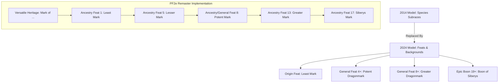
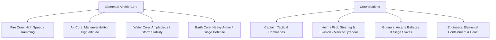

# Updates to PF2e Conversion for DMs Guild, D&D 2024, and D&D Beyond Partner Content

**Document Version:** 1.2.0  
**Target Systems:** Pathfinder 2e Remaster (Foundry VTT PF2e System 8.5.1+ / Foundry v14+)  
**Analyzed & Incorporated Sources:**

### 1. D&D 2024 / 5.5e Core Rules & System Architecture
- **D&D 2024 Player's Handbook & Free Rules:** Versatile Heritages paradigm for Dragonmarks, modern Origin Background structures, standard attribute bonuses, unified spell schools/traditions, and standard action economy balancing.

### 2. D&D Beyond Partner Content (KB Presents / Foundry Gaming LLC)
- [**Eberron: Forge of the Artificer (2024 / 5.5e)**](https://www.dndbeyond.com/marketplace/sourcebooks/eberron-forge-of-the-artificer) (Foundry Gaming LLC) — Elemental Airship combat and crew vehicle rules, Leyline Cartographer archetype, Dreadnaught Armorer model, modern dragonmark feat progression, and 14 Dragonmarked House Heir backgrounds.
- [**Exploring Eberron (2024 / 5.5e Update)**](https://www.dndbeyond.com/marketplace/sourcebooks/exploring-eberron) (Keith Baker, D&D Beyond / DMs Guild) — Kech Dhakaani lineages and masterwork relics, Mind domain, Forge Adept and Maverick artificers, Living Weapon monk, and Daelkyr symbiont grafts.
- [**Frontiers of Eberron: Quickstone (2024 / 5.5e)**](https://www.dndbeyond.com/marketplace/sourcebooks/frontiers-of-eberron-quickstone) (Keith Baker, D&D Beyond / DMs Guild) — Droaam and frontier backgrounds, expanded Wandslinger archetype, Demonshard barbarian, Bloodhound ranger, Nemesis sorcery, and Stone Sovereign witch.

### 3. DMs Guild Community Publications
- [**Chronicles of Eberron**](https://www.dmsguild.com/product/415474/Chronicles-of-Eberron) (Keith Baker / Twogether Studios, DMs Guild) — Lorghalan gnome heritage, noble backgrounds, sentira emotion weapons and spellhearts, Dark Six spells, spellshape feats, and legendary bestiary encounters (Avassh, Mordain).
- [**Morgrave Miscellany**](https://www.dmsguild.com/product/270012/Morgrave-Miscellany) (Keith Baker & Ruty Rutenberg, DMs Guild) — Karrnathi Bone Knight class archetype, Progenitor Dragon sorcerer bloodline, School of Antiquities wizard arcane curriculum, Way of the Argent Fist monk feats, evolutionary species feats (Warforged, Kalashtar, Shifter), and comprehensive class/archetype reflavoring mappings.
- **Exploring Eberron (Original DMs Guild Edition)** (Keith Baker) — Deep lore of the planes, aquatic races of the Thunder Sea, and cults of the Dragon Below.
- **Frontiers of Eberron: Quickstone (Original DMs Guild Edition)** (Keith Baker) — Frontier justice, gnolls of the Znir Pact, and the threshold between Breland and Droaam.

### 4. Canonical Foundation & Lore References
- **Eberron Campaign Setting (3.5e)** (Keith Baker, Bill Slavicsek, James Wyatt)
- **Eberron: Rising from the Last War (5e)** (Wizards of the Coast)
- **The Eberronicon** (DMs Guild / Concordance)

---

## Executive Summary & Design Architecture

This conversion synthesizes the modern **D&D 2024 (5.5e)** rules modernization, **D&D Beyond Partner Content** (*Forge of the Artificer*, *Exploring Eberron 5.5e*, *Frontiers of Eberron: Quickstone*), and classic **DMs Guild Community Publications** (*Chronicles of Eberron*, *Morgrave Miscellany*, *Exploring Eberron*) into the **Pathfinder 2e Remaster** system.

Rather than forcing 5e mechanics awkwardly into PF2e, this project leverages Pathfinder 2e's native modularity:
1. **Ancestries, Heritages & Ancestry Feats:** Modernized core Eberron ancestries; Dragonmarks function as Versatile Heritages open to any species matching 2024 D&D's open heritage design while fully utilizing PF2e ancestry feats and Remaster Focus pools.
2. **Backgrounds & Origin Options:** 14 House Heir backgrounds and frontier backgrounds granting standardized attribute boosts, Lore skills, and skill feats.
3. **Religions, Deities & Divine Domains:** Full pantheon fonts, edicts, anathemas, and divine domains (Commerce, Mind, Dark Six syncretisms) established prior to class options.
4. **Classes, Subclasses & Archetypes:** Modular archetypes (Bone Knight, Way of the Wandslinger, Leyline Cartographer) and class expansions (Progenitor Dragon bloodline, School of Antiquities curriculum, Living Weapon monk stances) adhering strictly to Remaster action economy and balance.
5. **Spells, Focus Spells & Magic Items:** Daelkyr symbionts, Dhakaani byeshk weapons, Riedran sentira implements, focus spells, and dragonmark magic modeled as native PF2e items, spellhearts, and grafts.
6. **Vehicles & Subsystems:** Elemental Airships mapped to PF2e Vehicle stat blocks and crew actions, while strongholds and enclaves leverage PF2e's native Downtime system (`Craft`, `Earn Income`, `Retrain`) rather than bolted-on subsystems.
7. **PF2e Concepts & Equivalents Guide:** Comprehensive cross-references and reflavoring instructions connecting 5e/DMsGuild archetypes to native PF2e classes and feats to prevent mechanical redundancy.

---

## 1. Ancestries, Heritages & Lineage Feats

### 1.1 Core Ancestry Modernizations (D&D 2024 Design & PF2e Remaster Alignment)

Modern revisions from D&D 2024 design principles and the PF2e Remaster streamline species abilities, resolving ambiguities in action economy, condition immunity, and size mechanics:

- **Changeling (`eberron-ancestries/`):**
  - *Change Shape:* Explicitly adapts cosmetic clothing and gear coloration (purely aesthetic) without requiring tailoring.
  - *Changeling Instincts (Feat 1):* Trained in Deception and Perception; +1 circumstance bonus to Lie and Sense Motive.
- **Kalashtar (`eberron-ancestries/`):**
  - *Dual Mind:* Harmonize with PF2e Remaster Will defense: +2 circumstance bonus to Will saves against mental and emotion effects.
  - *Severed from Dreams:* Permanent immunity to the *Sleep* spell and magical effects with the *Dream* trait.
- **Shifter (`eberron-heritages/`):**
  - *Shift (1 Action):* Standardize across all heritages: grants temporary HP equal to character level + Constitution modifier for 1 minute in addition to the heritage feature (*Beasthide*, *Longstride*, *Swiftstride*, *Wildhunt*).
  - *Reactive Shift (Feat 4, Reaction):* Trigger: An enemy enters reach; Step 10 feet away.
- **Warforged (`eberron-ancestries/`):**
  - *Constructed Resilience:* Retains the *Construct* trait and immunity to disease, sleep, and paralyzed conditions; clarify compatibility with the PF2e Remaster *Void/Vitality* healing rules.

---

### 1.2 Dragonmarks: The 2024 Shift to Versatile Heritages

#### The 2024 Paradigm Shift
In 2014 D&D (*Rising from the Last War*), dragonmarks were modeled as **variant species/subraces** (e.g. *Mark of Making Human*, *Mark of Storm Half-Elf*). In 2024 D&D (*Forge of the Artificer*, Chapter 2), dragonmarks undergo a fundamental architectural shift:
- **Dragonmarks are Feats, Not Species:** Characters of **any species** can manifest a dragonmark.
- **Four-Tiered Feat Hierarchy:** Least Mark (Level 1), Potent Dragonmark (General Feat 4+), Greater Dragonmark (General Feats 8+), and Boon of Siberys (Epic Boon 19+).

#### PF2e Modernization Path
Currently, [`Subsections/dragonmarks.txt`](file:///Users/jschoudt/git/github.com/jschoudt/Pathfinder2eConversion/Subsections/dragonmarks.txt#L22-L93) and `src/packs/eberron-heritages/` lock marks to specific ancestries (except for [`Aberrant Mark`](file:///Users/jschoudt/git/github.com/jschoudt/Pathfinder2eConversion/src/packs/eberron-heritages/Aberrant_Mark__Versatile__Dragonmarked_Ancestries__Heritage__3nDfWHKlc2YXHcDs.json), which is already a Versatile Heritage).

1. **Convert All 12 True Dragonmarks to Versatile Heritages:**
   - E.g., `Mark of Sentinel Versatile Heritage`, `Mark of Storm Versatile Heritage`.
   - *Why:* Aligns with 2024's "any species can manifest a mark," fixes legacy Half-Elf (Khoravar) heritage clunkiness, and accommodates House-adopted lineages.
2. **Harmonize Focus Pools with PF2e Remaster:**
   - In Remaster rules, characters Refocus to restore **all** spent Focus Points (10 minutes per point).
   - Update `Least Mark (Feat 1)`, `Lesser Dragonmarked Evolution (Feat 9)`, and `Siberys Mark (Feat 17)` to align with Remaster Focus Pool standards (max pool 3).
3. **Intuition Die Translation:**
   - 2024 adds a `1d4` Intuition Die to two skills per mark.
   - *PF2e Translation:* Grant a permanent **+1 circumstance bonus** to checks with those two skills, plus a 1-action fortune activity: **Mark's Intuition** (Frequency: once per hour; roll twice and take the higher result).
4. **Distinct Greater Dragonmark Feats:**
   - Add individual Level 13 `Greater Mark` feats for each house (e.g., *Greater Mark of Storm*, *Greater Mark of Making*) granting innate rank 7-8 spells (*Control Weather*, *Fabricate*, *Teleport*).

---

## 2. Backgrounds & Origin Options

In 2024 D&D, backgrounds define origin feats and attribute increases. In PF2e, Backgrounds provide two attribute boosts, trained skill proficiencies, lore, and a skill feat.

### 2.1 The 14 Dragonmarked House Heir Backgrounds
Add 14 House Heir Backgrounds to `src/packs/eberron-backgrounds/`:
- **House Cannith Heir:** Boosts: Intelligence, Free. Trained in Crafting and *House Cannith Lore*. Skill Feat: *Crafter's Appraisal*. Grants access to Mark of Making feats.
- **House Deneith Heir:** Boosts: Strength or Charisma, Free. Trained in Athletics and *House Deneith Lore*. Skill Feat: *Combat Climber*. Grants access to Mark of Sentinel feats.
- **House Medani Inquisitive Heir:** Boosts: Intelligence or Wisdom, Free. Trained in Perception/Investigation and *House Medani Lore*. Skill Feat: *That's Odd* or *Notice Signs*. Grants access to Mark of Detection feats.
- **House Sivis Scribe Heir:** Boosts: Intelligence or Charisma, Free. Trained in Society and *House Sivis Lore*. Skill Feat: *Multilingual*. Grants access to Mark of Scribing feats.
- **Aberrant Heir:** Boosts: Constitution, Free. Trained in Intimidation and *Underworld Lore*. Skill Feat: *Intimidating Glare*. Grants access to Aberrant Mark feats.

### 2.2 Frontier & Droaam Backgrounds (*Quickstone*)
- **Dragonshard Prospector:** Boosts: Wisdom or Constitution, Free. Trained in Survival and *Dragonshard Lore*. Skill Feat: *Terrain Stalker*.
- **Wandslinger Veteran:** Boosts: Dexterity or Charisma, Free. Trained in Acrobatics and *Warfare Lore*. Skill Feat: *Quick Draw* (or *Wand Draw*).
- **Frontier Marshal:** Boosts: Wisdom or Strength, Free. Trained in Survival and *Legal Lore*. Skill Feat: *Experienced Tracker*.
- **Droaam Emissary:** Boosts: Charisma or Intelligence, Free. Trained in Diplomacy and *Droaam Lore*. Skill Feat: *Hobnobber*.

---

## 3. Religions, Deities & Divine Domains

Before implementing Divine and Primal classes, their patron deities, edicts, anathemas, and divine domains must be established:

### 3.1 New & Expanded Domains
- **Commerce Domain (Kol Korran & House Kundarak):**
  - *Initial Focus Spell (1st Rank):* **Divine Coin Toss** (1 Action). Gamble fortune: roll 1d4 on an ally's d20 check; on 1, +1 status bonus; on 4, +3 status bonus.
  - *Advanced Focus Spell (4th Rank):* **Contractual Recoil** (Reaction). When an enemy violates an agreement, attacks a protected ward, or reneges on a surrender, deals 1d6 force damage per spell rank.
- **Mind Domain (Path of Light, Reidran Faiths):**
  - *Initial Focus Spell:* **Mental Shielding** (Reaction). +2 status bonus against mental effects; reflects psychic feedback.
  - *Advanced Focus Spell:* **Thought Projection** (2 Actions). Transmit telepathic commands and reveal enemy intent (+1 to AC against target).

### 3.2 Frontier & Droaam Syncretisms (*Quickstone*)
- **The Dark Six (Frontier Cults):** The Shadow (arcane corruption), The Fury (passion and wild revenge), The Mockery (cunning warfare in Droaam).
- **Medusa / Stone Sovereign Faith:** Earth veneration, petrification as eternal preservation, architectural sculpting.

---

## 4. Classes, Subclasses & Archetypes

### 4.1 Artificer & Inventor Innovations (*Forge of the Artificer* & *EE 5.5e*)

- **Leyline Cartographer (Brand New Subclass -> Inventor / Witch / Investigator Archetype):**
  - *Cartographer's Craft:* Trained in Surveying Lore; ignore non-magical difficult terrain.
  - *Survey the Ley Lines (1 Action):* Grant allies within 30 ft a +10 ft status bonus to speed for 1 round.
  - *Waypoint Anchor (Focus Spell):* Place a teleportation tether beacon that allies can warp to.
  - *Leyline Shifting (Feat 8):* Reconfigure terrain in a 20-ft burst.
- **Dreadnaught Armorer Model (New 2024 Heavy Armor Model):**
  - *Dreadnaught Juggernaut Suit (Modification):* Heavy armor with Bulwark; +1 circumstance to Shove/Trip.
  - *Force Demolisher Strike (Feat 4):* 1d10 Bludgeoning + 1d6 Force; ignores half object Hardness.
  - *Giant Stature Overcharge (Feat 12, Unstable):* Grow to Large/Huge, +10 ft reach, +2 status bonus to melee damage.
- **Forge Adept (*Exploring Eberron 5.5e*):**
  - *Ghaal'shaarat Bond:* Weapon automatically scales fundamental runes; gains *Resonant* trait.
  - *Runes of War (Focus Spell):* Imbue weapon with elemental or vitality/void damage.
- **Maverick (*Exploring Eberron 5.5e*):**
  - *Cross-Tradition Spell Hacking:* Prepare 1 spell per rank from Divine, Occult, or Primal lists into Arcane slots.

### 4.2 Wandslinger & Western Frontier Archetypes (*Quickstone*)

- **College of Wands (Bard) & Way of the Wandslinger Expansion:**
  - Expand [`Way_of_the_Wandslinger`](file:///Users/jschoudt/git/github.com/jschoudt/Pathfinder2eConversion/src/packs/eberron-classes/Way_of_the_Wandslinger_PMZjc5rLWtWV9vEW.json) with *Wand Dueling*, *Quick-Draw Wand*, and *Deflective Cantrip* reactions.
- **Path of the Demonshard (Barbarian):**
  - *Khyber Demonshard Instinct:* Rage adds Void/Fire damage, grants physical resistance against non-byeshk weapons, and causes frightened aura.
- **Bloodhound (Ranger):**
  - *Bloodhound Hunter's Edge:* Relentless pursuit, scent imprecise sense 30 ft, bonus against disguises.
- **Nemesis Sorcery:**
  - *Nemesis Bloodline (Occult):* Retributive curses and focus spells that punish attackers.
- **Stone Sovereign (Witch / Patron):**
  - *Stone Sovereign Patron:* Earth kineticist crossover, petrification gaze, and calcified armor.

### 4.3 Dhakaani & Forged Traditions (*Exploring Eberron 5.5e*)

- **College of the Dirge Singer (Bard):**
  - *Song of the Iron Will (Composition Cantrip):* +1 status bonus to Will saves against fear and +1 to Athletics.
  - *Dirge of the Victorious Blade (Focus Spell):* On ally critical hit, deals sonic/mental damage in 10-ft burst.
- **Circle of the Forged (Druid):**
  - *Construct Wild Shape:* Retains Construct trait, Integrated Plating (+1 AC), resistance to precision and bleed.
- **Warrior of the Living Weapon (Monk):**
  - *Tendril Whip Stance (Feat 1):* Unarmed attacks gain 10-ft reach, Finesse, Trip.
  - *Carapace Stance (Feat 4):* 1d8 Bludgeoning with Parry; +1 circumstance to AC and physical resistance.

---

## 5. Spells, Focus Spells & Magic Items

### 5.1 Spells & Focus Spells
- **Dragonmark Focus Spells:** Review and balance all rank 1–9 focus spells in `eberron-spells/` to ensure full Remaster compliance.
- **Spells of the Mark:** Ensure spell lists are mapped to Arcane, Divine, Occult, and Primal traditions.

### 5.2 Daelkyr Symbionts (PF2e Grafts / Relics)
- **Living Breastplate (Item 10, Rare):** Chitinous armor bonding to flesh; +1 to Fortitude saves vs poison/disease; regenerates 5 HP / 10 min; requires vitality feeding.
- **Tentacle Whip (Item 7, Rare):** Finesse martial weapon (1d6 Slashing, Reach 10 ft, Agile, Trip); inflicts stupefied/poison on critical hits.
- **Tongue Worm (Item 6, Rare):** Mouth parasite unarmed strike (1d4 Piercing + 1d6 Poison).
- **Breed Leech (Item 8, Rare):** Grants critical hit immunity by absorbing blunt force, at cost of drained 1.

### 5.3 Dhakaani Masterworks & Relics
- **Ghaal'shaarat Weapons (Item 8-16, Unique):** *Byeshk* and adamantine; bypasses aberration resistances and psychic shielding.
- **Atchaas Armor (Item 9, Rare):** Adamantine plate woven with honor oaths; immunity to Frightened condition.

---

## 6. Subsystems & Campaign Frameworks

### 6.1 Elemental Airships & Aerial Combat Subsystem

*Forge of the Artificer* Chapter 7 provides modern rules for operating, upgrading, and fighting aboard elemental airships.

- **Airship Stat Blocks (PF2e Vehicles):**
  - *Lyrandar Skyskiff (Level 6 Vehicle):* Fly Speed 60 ft, Pilot: Mark of Lyrandar or DC 22 Arcana/Nature.
  - *Lyrandar Air Cruiser (Level 11 Vehicle):* Fly Speed 45 ft, Hardness 15, HP 240.
  - *Strider War Airship (Level 16 Vehicle):* Fly Speed 40 ft, Hardness 20, HP 400.
- **Crew Actions:** *Pilot (1 Action)*, *Evasive Maneuver (2 Actions)*, *Overcharge Elemental Ring (1 Action)*.
- **Airship Upgrades:** *Cloudburst Sails*, *Elemental Thrusters*, *Arcane Harpoon Cannon*.

### 6.2 Strongholds & Enclaves in PF2e (Native Downtime vs. Bastions)

In D&D 2024, the "Bastion" subsystem introduced automated facility orders and turn-based base upkeep. **Pathfinder 2e does not have or need a Bastion subsystem.** Instead, Eberron strongholds and facilities map directly to native PF2e mechanics:
- **No Custom Bastion Rules Required:** An alchemical lab, an inquisitive bureau in Sharn, a Morgrave research station, or an airship berth are handled naturally through standard PF2e [Downtime Activities](https://2e.aonprd.com/Rules.aspx?ID=2446) (`Craft`, `Earn Income`, `Learn a Spell`, `Retrain`).
- **Base Improvements (Optional GM Tools):** For campaigns where party bases play a central role, GMs can utilize PF2e's official Citadel/Base rules (e.g. *Age of Ashes* / *GM Core*), where an upgraded workshop or library grants a **+1 or +2 circumstance bonus** to relevant Crafting, Lore, or Earn Income checks, avoiding unnecessary mechanical bloat.

### 6.3 Noir Investigation & Sharn Inquisitives
- Direct integration with the PF2e Investigator class (*Pursue a Lead*, *Clue In*, *That's Odd*), forensics, and criminal syndicate networks.

---

## 7. Re-Ordered Implementation Roadmap

Following the natural character creation and dependency sequence:

| Phase | Milestone | Target Compendium Packs | Status | Date/Time Completed |
| :--- | :--- | :--- | :--- | :--- |
| **Phase 1** | **Ancestries & Dragonmarks** | `eberron-ancestries/`, `eberron-heritages/`, `eberron-dragonmarks/` | Completed | 2026-09-20 12:35 EDT |
| **Phase 2** | **Backgrounds & Origins** | `eberron-backgrounds/` | Completed | 2026-09-20 12:49 EDT |
| **Phase 3** | **Religions & Deities** | `eberron-deities/`, `eberron-spells/` | Completed | 2026-09-20 12:56 EDT |
| **Phase 4** | **Classes & Archetypes** | `eberron-classes/`, `eberron-feats/` | Completed | 2026-09-20 13:02 EDT |
| **Phase 5** | **Spells & Magic Items** | `eberron-spells/`, `eberron-items/` | Completed | 2026-09-20 13:18 EDT |
| **Phase 6** | **Vehicles & Bestiary** | `eberron-items/` (Vehicles), `eberron-creatures/` | Completed | 2026-09-20 13:29 EDT |
| **Post-Phase** | **Automated Scribe PDF Generation** | `tools/generate_pdf.mjs`, `pathfinders-guide-to-eberron.pdf` | Completed | 2026-09-20 13:41 EDT |
| **Phase 7** | **Chronicles of Eberron Integration** | Foundry packs, Pathbuilder, Scribe Subsections, PDF | Completed | 2026-09-20 18:20 EDT |
| **Phase 8** | **Eberron Concepts & PF2e Equivalents Guide** | `eberron-journals/`, Scribe `eberron-equivalents.txt`, HTML/PDF | Completed | 2026-09-20 19:10 EDT |
| **Phase 9** | **Morgrave Miscellany Integration** | Foundry packs, Pathbuilder, Scribe Subsections, Equivalents | Completed | 2026-09-20 19:18 EDT |
| **Phase 10** | **Multi-Source Synthesis & Legal Packaging** | Legal notices, CHANGELOG, README, Scribe HTML/PDF (7.01 MB) | Completed | 2026-09-20 19:20 EDT |

---

## 8. Chronicles of Eberron Integration (Keith Baker / Twogether Studios)

All player and DM options from *Chronicles of Eberron* categorized as **Category 1 (High Priority / Unique)** and **Category 2 (Adapted & Synthesized)** have been converted and fully integrated into the Foundry VTT compendiums, Scribe publication document (HTML + PDF), and the Pathbuilder 2e custom pack. Each element adheres to PF2e Remaster guidelines and cites its exact source and page number.

### 8.1 Integrated Content Summary

1. **Ancestry Heritages:**
   - *Lorghalan Gnome* (`eberron-heritages`, *Chronicles of Eberron*, p. 19): Gnome heritage attuned to the Feyspire of Lorghalan; gains *Light* or *Prestidigitation* and bonuses against emotion/mental effects.
2. **Backgrounds:**
   - *Displaced Noble* (`eberron-backgrounds`, *Chronicles of Eberron*, p. 21): Boosts to Charisma or Constitution, trained in Society and Cyre Lore, gains *Courtly Graces*.
   - *Newly Risen Noble* (`eberron-backgrounds`, *Chronicles of Eberron*, p. 21): Boosts to Charisma or Intelligence, trained in Society and Heraldry/Nobility Lore, gains *Connections*.
   - *Disgraced Noble* (`eberron-backgrounds`, *Chronicles of Eberron*, p. 21): Boosts to Dexterity or Charisma, trained in Deception and Underworld Lore, gains *Subtle Theft*.
3. **Feats:**
   - *Tairnadal Revenant* (`eberron-feats`, *Chronicles of Eberron*, p. 42): Level 4 Elf feat. Ties the elf's spirit to their patron ancestor; once per day upon reaching 0 HP, immediately stay at 1 HP and Strike.
   - *Stonesinger* (`eberron-feats`, *Chronicles of Eberron*, p. 108): Level 1 Gnome feat. Medani / Lorghalan stone-whispering; cast *Read the Rubble* once per day as an innate primal spell.
   - *Defiled Gift Spellshape* (`eberron-feats`, *Chronicles of Eberron*, p. 154): Level 6 Spellshape feat. Overchannel with Overlord / Fiendish corruption; convert damage to void and apply sickened or frightened, inflicting self-damage or off-guard on a critical failure.
   - *Reverse Speech Spellshape* (`eberron-feats`, *Chronicles of Eberron*, p. 154): Level 4 Spellshape feat. Speak in reverse fiendish cadence; auditory spells conceal verbal components and grant bonuses against Counteract attempts.
4. **Spells:**
   - *Awaken Ambition* (`eberron-spells`, Rank 2, *Chronicles of Eberron*, p. 115): Dark Six (The Shadow/The Traveler) curse that inflames selfish ambition, imposing penalties to cooperative checks and aid.
   - *Shadow's Gifts* (`eberron-spells`, Rank 4, *Chronicles of Eberron*, p. 116): Grant a willing target darkvision, concealment in dim light, and bonus void damage on Strikes.
   - *Fury's Chorus* (`eberron-spells`, Rank 3, *Chronicles of Eberron*, p. 116): Aura of wrathful cacophony imposing sonic/mental damage on nearby creatures that take hostile actions.
   - *Keeper's Vault* (`eberron-spells`, Rank 5, *Chronicles of Eberron*, p. 117): Wards an area against soul transfer, reanimation, and planar passage; captures slain souls in a warding gem.
5. **Equipment, Weapons & Implements:**
   - *Sentira Hand Lens, Light Lens, Heavy Lens* (`eberron-items`, *Chronicles of Eberron*, p. 66-67): Riedran crystallized emotion focus weapons (Agile/Finesse, Concealable, Reach/Forceful) acting as psychic/occult spell amplifiers.
   - *Sentira Shards (Anxiety, Dread, Grief)* (`eberron-items`, *Chronicles of Eberron*, p. 67): Spellheart/talisman attachments granting emotional psychic resonance and spell effects.
   - *Cannith Spellbolt* (`eberron-items`, *Chronicles of Eberron*, p. 143): Alchemical/magical ammunition delivering elemental or debuff payload on impact.
   - *Crossbow Silencer* (`eberron-items`, *Chronicles of Eberron*, p. 144): House Tarkanan / inquisitive weapon modification that muffles crossbow discharge to prevent auditory detection.
6. **Creatures & Threat Bestiary:**
   - *Mordain the Fleshweaver* (`eberron-creatures`, Level 18 Unique Aberrant Fleshcrafter, *Chronicles of Eberron*, p. 129): Transmutation maestro of the Blackroot, Fleshwarp Grafting, Aberrant Transmutation Aura, and Master Fleshcrafting.
   - *Avassh, the Twister of Roots* (`eberron-creatures`, Level 22 Unique Daelkyr Lord / Plant Aberration, *Chronicles of Eberron*, p. 195): Ancient Daelkyr lord of subterranean fungal networks, withering root tendrils, Mind Pollen Spores, and subterranean assimilation.

### 8.2 Build & Compilation Outputs
- **Foundry Compendium Pack JSONs:** 22 item/creature/feat records added to `src/packs/`.
- **LevelDB Foundry Modules:** Built and compiled to `pathfinders-guide-to-eberron/packs/`.
- **Pathbuilder Custom Pack:** Fully enriched `pathbuilder-custom-pack/pathfinders-guide-to-eberron.json`.
- **Scribe Source Documents:** `Subsections/ancestries.txt`, `Subsections/backgrounds.txt`, `Subsections/feats.txt`, `Subsections/items-of-eberron.txt`, `Subsections/spells.txt`.
- **Publication Artifacts:** Cleanly generated `pathfinders-guide-to-eberron.html` and `pathfinders-guide-to-eberron.pdf` (6.68 MB).

---

## 9. Eberron Concepts & Pathfinder 2e Equivalents Guide

A master cross-reference and reflavoring guide connecting classic Eberron character archetypes, tropes, and mechanics across all processed sourcebooks (*Exploring Eberron*, *Frontiers of Eberron*, *Forge of the Artificer*, *Chronicles of Eberron*, *Morgrave Miscellany*, and classic 3.5e/5e ECS) to their native Pathfinder 2e Remaster equivalents.

### 9.1 Publication & Delivery Channels
- **Scribe Document Subsection:** Created `Subsections/eberron-equivalents.txt` and integrated into `Pathfinder-2e-Eberron-Conversion.txt` and `tools/generate_pdf.mjs`.
- **Stand-Alone Publications:** Recompiled `pathfinders-guide-to-eberron.html` and `pathfinders-guide-to-eberron.pdf` (6.89 MB).
- **Foundry VTT Compendium Pack:** Registered `eberron-journals` (`JournalEntry` pack) in `pathfinders-guide-to-eberron/module.json` and compiled `src/packs/eberron-journals/eberron-mechanics-and-equivalents.json` (4 comprehensive pages).
- **Full Test Suite & Validation:** All 661 Vitest tests and Tier 1 headless Foundry v14 schema validators passed with 0 errors.

---

## 10. Morgrave Miscellany Integration & PF2e Equivalents Expansion

All recommendations for *Morgrave Miscellany* (Keith Baker & Ruty Rutenberg) have been implemented. Bespoke Pathfinder 2e Remaster conversions were created for Category 1 options, while Category 2 and 3 subclasses, archetypes, and racial options were mapped into the newly created **Eberron Concepts & PF2e Equivalents** guide in both Scribe text and Foundry compendium journals.

### 10.1 Converted Mechanics & Character Options (Category 1)

1. **Karrnathi Bone Knight Archetype (`eberron-classes` & `eberron-feats`):**
   - *Bone Knight Dedication (Feat 2):* Bonecraft armoring, resistance to vitality/void damage, and saves vs disease/fear.
   - *Bonecraft Mastery (Feat 4):* Bonecraft weapons deal +1d4 void/cold damage and gain deadly d6.
   - *Ivory Mount (Feat 4):* Skeletal undead mount immune to bleed, death, disease, paralyzed, poison, and unconscious.
   - *Master of the Ivory Banner (Feat 8):* 30-foot aura granting +1 attack, +2 saves vs fear, and DC 15 death prevention check for undead allies.
   - *Marrow Death Strike (Feat 12):* Melee strike dealing +3d8 void damage; critical hits inflict drained 1 and enfeebled 1.
   - *Grim Conscription (Feat 16, Reaction):* Reanimate a slain adjacent foe as a temporary skeleton/zombie minion for 1 minute.
2. **Progenitor Dragon Sorcerer Bloodline (`eberron-classes` & `eberron-spells`):**
   - Choose patron: **Siberys** (Arcane), **Eberron** (Primal), or **Khyber** (Occult).
   - Granted focus spells:
     - *Shape of Creation (Focus 1):* Elemental matter reshaping burst dealing 2d6 damage and creating difficult terrain.
     - *Cradle of Life (Focus 3):* Protective vitality mantle restoring 3d8 HP and +1 status to AC/saves (or void healing for Khyber).
     - *Progenitor's Awakening (Focus 6):* Dragonshard wings, fly Speed, resistance 5 physical, and 8d6 breath weapon cone.
3. **School of Antiquities Wizard Curriculum (`eberron-classes` & `eberron-spells`):**
   - Morgrave University curriculum specializing in Xen'drik exploration and the Draconic Prophecy.
   - Granted focus spells:
     - *Surveyor of Ruin (Focus 1):* Rapid structural analysis granting +2 status against hazards or +1 status to attack analyzed foes.
     - *Personal Prophecy (Focus 3):* Glimpse destiny as a reaction, granting fortune to allies or misfortune to enemies.
4. **Way of the Argent Fist Monk Feats (`eberron-feats`):**
   - *Argent Fist Stance (Feat 4):* Unarmed strikes gain agile, finesse, holy, nonlethal, silver, and deal +1d4 spirit damage and count as cold iron vs fiends/undead.
   - *Wrath of the Argent Flame (Feat 8):* 15-foot sanctified cone dealing 4d6 fire and 4d6 spirit damage, dazzling or blinding fiends/undead.
5. **Evolutionary Species Feats (`eberron-feats`):**
   - *Integrated Arcana (Warforged Feat 1):* Integrated wand/focus socket and innate arcane cantrip.
   - *Warforged Colossus (Warforged Feat 9):* 1-minute transformation to Large size (+5 ft reach, 15 temp HP, +2 melee damage).
   - *Atavist (Kalashtar Feat 5):* Resistance to mental damage and upgraded success on saves vs mental conditions.
   - *Quori Nightmare (Kalashtar Feat 9):* Dal Quor mental pulse dealing 5d6 damage and inflicting fear/fleeing.
   - *Weretouched Master (Shifter Feat 5):* Shifting attacks gain deadly d8 or agile/finesse, +10 ft speed, and darkvision.
   - *Moonspeaker (Shifter Feat 9):* Lunar attunement granting *mist* and *moonbeam* as innate primal spells.

### 10.2 Equivalents & Reflavoring Integrations (Categories 2 & 3)
- **Bardic Colleges:** Mapped *College of the Keys* to Rogue/Bard vault-crackers and *College of the Shadow* to Maestro Bard / Shadowdancer.
- **Barbarian:** Mapped *Path of the Juggernaut* to Fury/Giant Instinct construct overcharging.
- **Warlock Patrons:** Mapped alien daelkyr/undying court patrons to Witch (Curse/Baba Yaga) or Living Vessel Archetype.
- **Planar Strangers:** Mapped *Githzerai / Githyanki* in Eberron to Human/Android + Psychic or Mind Smith.
- **Compendium & Documentation Synchronizations:** Updated `Subsections/eberron-equivalents.txt`, `src/packs/eberron-journals/eberron-mechanics-and-equivalents.json` (new 5th page added), `Subsections/classes.txt`, `Subsections/feats.txt`, `pathbuilder-custom-pack/pathfinders-guide-to-eberron.json` (407 feats, 118 spells), and recompiled HTML and PDF (7.01 MB).

